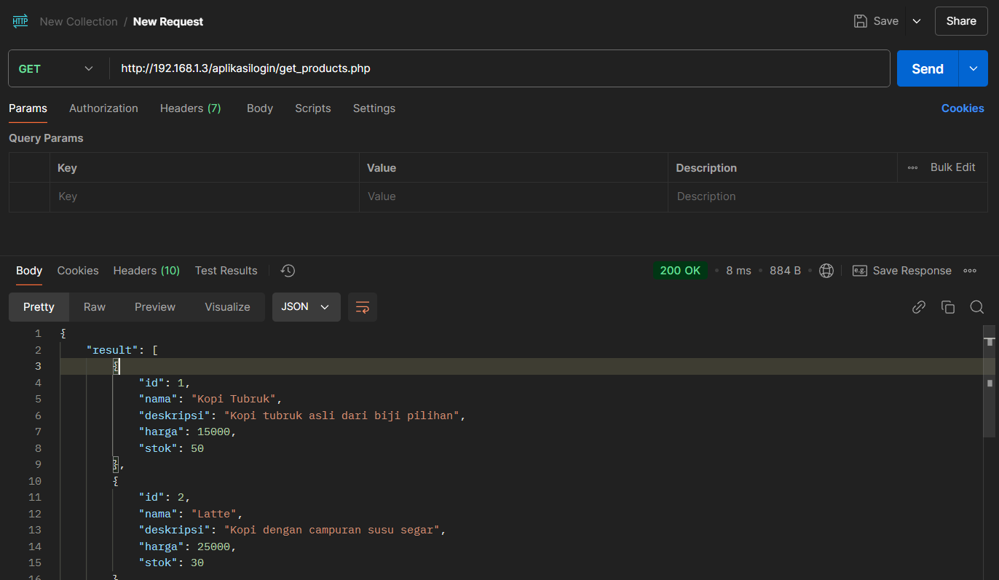

## **Langkah-langkah Penggunaan** 🚀

### 1. **Membuat Tabel Produk** 🗄️
Pertama, jalankan query berikut di database untuk membuat tabel `products`:

```sql
CREATE TABLE products (
    id SERIAL PRIMARY KEY,
    nama VARCHAR(100) NOT NULL,
    deskripsi TEXT,
    harga INT NOT NULL,
    stok INT NOT NULL
);
```

### 2. **Menambahkan Data Produk** 🧩
Selanjutnya, masukkan data produk ke dalam tabel `products` menggunakan query berikut:

```sql
INSERT INTO products (nama, deskripsi, harga, stok) VALUES
('Produk 1', 'Deskripsi produk 1', 15000, 50),
('Produk 2', 'Deskripsi produk 2', 25000, 30),
('Produk 3', 'Deskripsi produk 3', 20000, 40),
('Produk 4', 'Deskripsi produk 4', 27000, 35),
('Produk 5', 'Deskripsi produk 5', 28000, 25);
```

### 3. **Menambahkan API Endpoint** 🌐
Download file `get_products.php` dan letakkan di dalam folder `aplikasilogin`.

### 4. **Testing API dengan Postman** 🖥️
Lakukan pengujian API endpoint `get_products.php` menggunakan Postman di URL berikut:
```
http://{IP_ADDRESS}/aplikasilogin/get_products.php
```
**Contoh tampilan hasil testing**:


### 5. **Mengambil Data dan Menampilkan Produk** 🏠
Gunakan API endpoint untuk mengambil data produk dan tampilkan di halaman utama aplikasi setelah login.

---

## **Hasil Aplikasi** 🎥

Berikut adalah video demo aplikasi yang menunjukkan bagaimana aplikasi menampilkan daftar produk setelah login:
[Video Running Aplikasi](assets/running-program.mp4)

---

## **Catatan Pengembangan** 📝

- Pastikan server dan database berfungsi dengan baik.
- Pastikan URL API di Postman sudah diatur dengan benar (ganti `{IP_ADDRESS}` dengan alamat server yang sesuai).
- Jika ada kesalahan dalam penulisan atau pengaturan, periksa kembali query dan pengaturan API.

---

## **Selamat Mengerjakan Semoga Sukses!** 🎉